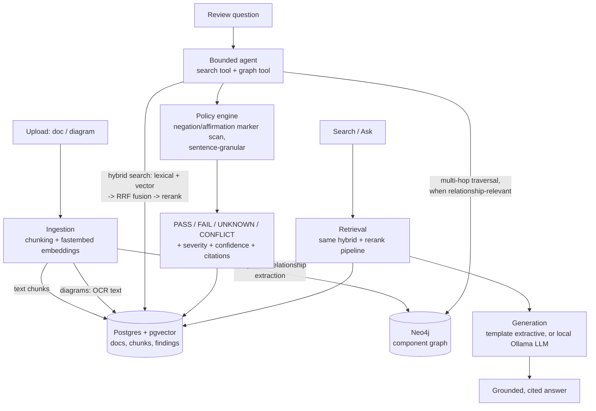
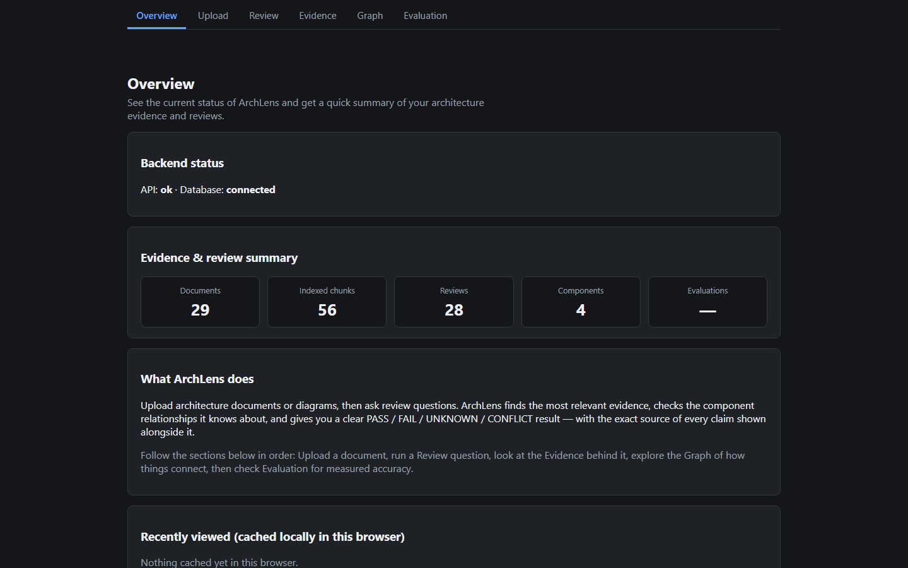
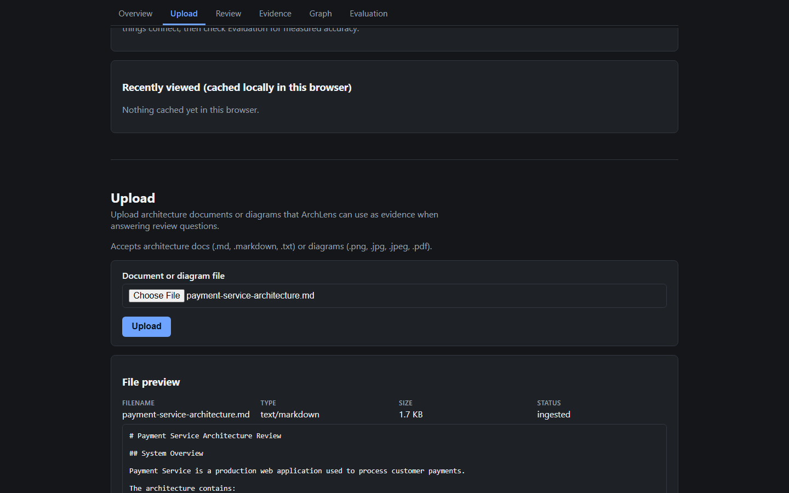
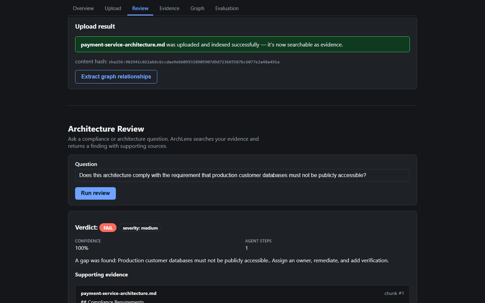
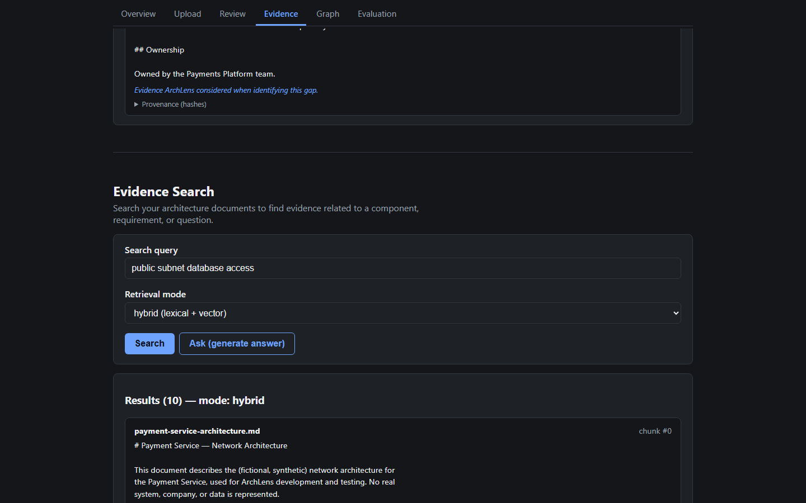
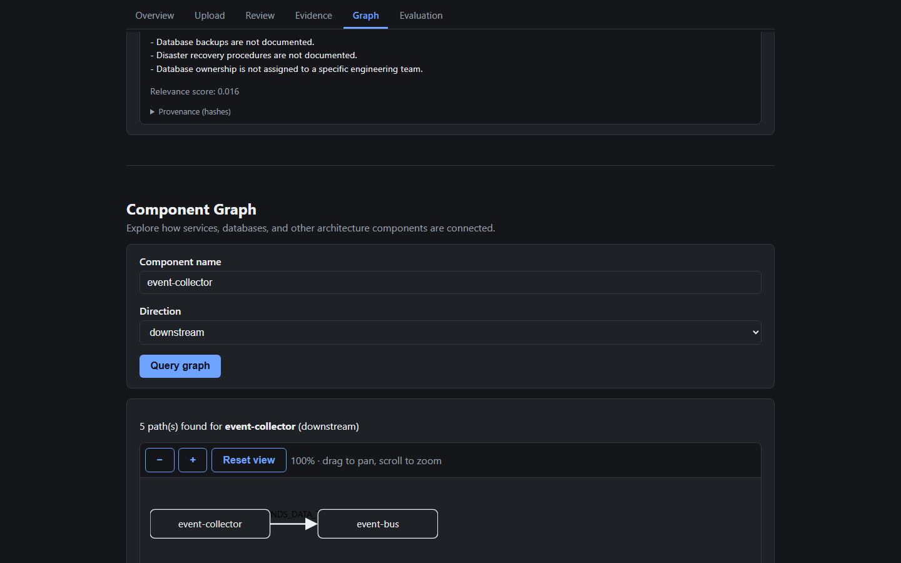
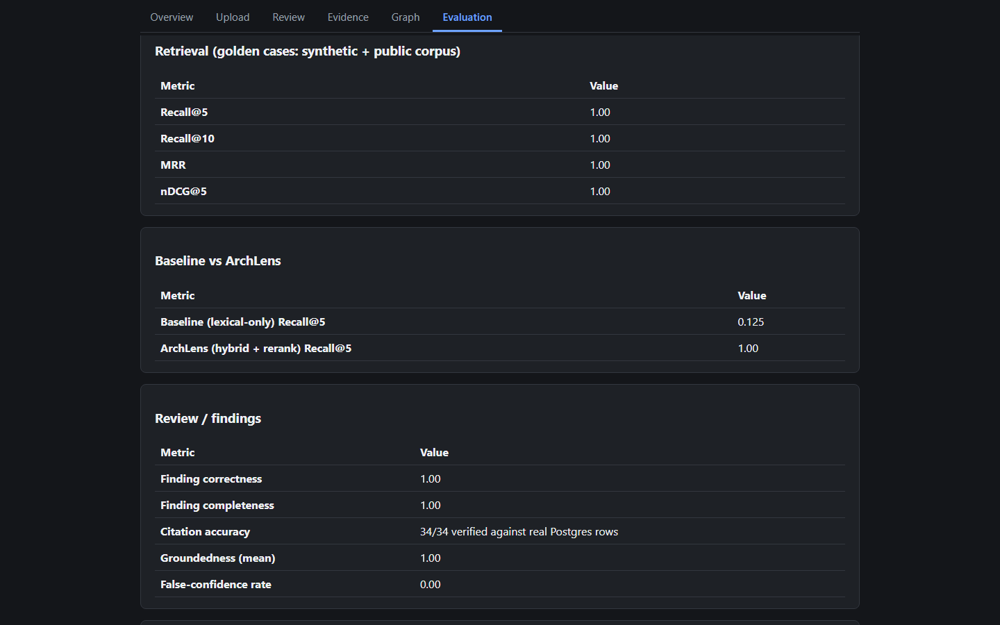

<h1 align="center">ArchLens</h1>
<p align="center"><strong>AI Architecture Risk &amp; Compliance Reviewer</strong> — upload architecture docs, ask a compliance question, get a cited PASS/FAIL/UNKNOWN/CONFLICT verdict.</p>

<p align="center">
  <a href="https://github.com/yspremreddy/Archlens/actions/workflows/ci.yml"></a>
  <a href="LICENSE"></a>
  
  
  
  
  
  
</p>

---

## Table of Contents

- [Overview](#overview)
- [Key Features](#key-features)
- [Architecture](#architecture)
- [Screenshots](#screenshots)
- [Demo](#demo)
- [Quick Start](#quick-start)
- [Environment Variables](#environment-variables)
- [Usage](#usage)
- [Testing, Lint &amp; Build](#testing-lint--build)
- [Project Structure](#project-structure)
- [Security](#security)
- [Evaluation](#evaluation)
- [Limitations](#limitations)
- [Roadmap](#roadmap)
- [Contributing](#contributing)
- [License](#license)

## Overview

Architecture and compliance reviews are usually manual: someone reads a
design doc, cross-checks it against a list of requirements, and writes up
findings by hand. **ArchLens automates the first pass** — upload an
architecture document (or a diagram), ask a plain-English compliance
question, and get back a verdict with the exact evidence behind it.

Every claim ArchLens makes is traceable to a real document, chunk, and
content hash — there is no "trust me" step. And when the evidence doesn't
clearly support or contradict a claim, ArchLens says **UNKNOWN** rather than
guessing (see the [demo](#demo) for a real example of exactly that).

It runs entirely locally and for free: local embeddings and reranking (ONNX,
no torch/GPU required), a rule-based (not LLM-judged) policy engine, and an
optional local LLM via [Ollama](https://ollama.com) — Postgres/pgvector and
Neo4j are the only services, both via Docker. No paid API is required in the
default configuration.

## Key Features

- **PASS / FAIL / UNKNOWN / CONFLICT verdicts** with severity, confidence,
  and a recommendation — never a bare yes/no.
- **Hybrid retrieval**: PostgreSQL full-text search + pgvector semantic
  search, fused with Reciprocal Rank Fusion, then reranked with a local
  cross-encoder.
- **Component relationship graph** (Neo4j): extracted from architecture
  docs/diagrams, queryable for multi-hop upstream/downstream questions.
- **Multimodal ingestion**: diagrams (PNG/JPG/PDF) are OCR'd and indexed
  alongside text — searchable and citable the same way.
- **Bounded, read-only agent**: a deterministic controller (not free-form
  LLM tool use) that searches evidence and, when relevant, queries the
  graph — with hard step/time limits and no write access to anything.
- **Full evidence provenance**: every citation carries the source document
  filename, a document content hash, a chunk content hash, and the actual
  matched text — not just a reference to look up later.
- **Security-conscious by design**: ingested content is always treated as
  untrusted data, never as instructions (see [Security](#security)).
- **Single-page UI**: Overview → Upload → Review → Evidence → Graph →
  Evaluation, all on one scrollable page with a sticky, smooth-scrolling
  nav.

## Architecture



See [docs/ARCHITECTURE.md](docs/ARCHITECTURE.md) for the full design and
[docs/DECISIONS.md](docs/DECISIONS.md) for the ADR log covering every
non-trivial choice (why hybrid retrieval, why rule-based policy instead of
LLM-judged, why sentence-granular evidence scanning, etc.).

### Stack

| Layer | Technology |
|---|---|
| Backend | FastAPI, SQLAlchemy 2.0 + Alembic |
| Retrieval | PostgreSQL 16 + pgvector (lexical FTS + vector search), fastembed (ONNX embeddings + cross-encoder reranking, no torch) |
| Graph | Neo4j 5 Community Edition |
| Multimodal | rapidocr-onnxruntime, pypdfium2 |
| Generation (optional) | [Ollama](https://ollama.com) local LLM/vision — off by default (deterministic template provider) |
| Observability | OpenTelemetry (optional, off by default) |
| Frontend | React 18+, TypeScript, Vite, hand-written CSS, Vitest + Testing Library, Playwright |

No new major frameworks beyond what's needed: no React Router (anchor-link
scrolling), no charting library (the graph view is hand-rolled inline SVG
with pan/zoom), no ORM-generated client (types are hand-mirrored from the
Pydantic schemas).

## Screenshots

<table>
  <tr>
    <td width="50%"></td>
    <td width="50%"></td>
  </tr>
  <tr>
    <td align="center"><em>Overview — live backend status + real counts</em></td>
    <td align="center"><em>Upload — file preview + indexing confirmation</em></td>
  </tr>
  <tr>
    <td width="50%"></td>
    <td width="50%"></td>
  </tr>
  <tr>
    <td align="center"><em>Review — real FAIL verdict with cited evidence</em></td>
    <td align="center"><em>Evidence Search — real hybrid search results</em></td>
  </tr>
  <tr>
    <td width="50%"></td>
    <td width="50%"></td>
  </tr>
  <tr>
    <td align="center"><em>Graph — real extracted relationships (pan/zoom)</em></td>
    <td align="center"><em>Evaluation — last-measured metrics</em></td>
  </tr>
</table>

All screenshots are real, unedited captures of the running app in dark mode
(`frontend/scripts/capture-screenshots.mjs`) against live backend responses
— not mockups.

## Demo

[`assets/demo/payment-service-architecture.md`](assets/demo/payment-service-architecture.md)
is a synthetic architecture doc run through the real `/review` pipeline five
times, covering exactly the findings you'd want a compliance reviewer to
catch:

| Question | Verdict | Why |
|---|---|---|
| Must production customer DBs not be publicly accessible? | **FAIL** | Doc states the requirement *and* that PostgreSQL is deployed in a public subnet with public network access |
| Is customer payment data encrypted? | **PASS** | Doc states application-layer encryption |
| Are payment records retained ≥ 7 years? | **UNKNOWN** | Doc says "retained for 7 years" — phrasing the policy engine doesn't have a marker for; it correctly abstains instead of guessing |
| Does PostgreSQL have documented failover? | **CONFLICT** | One sentence contains both an affirmation ("has a...") and a negation ("no documented failover") — surfaced as a genuine conflict |
| Are backups/DR procedures documented? | **UNKNOWN** | Doc says "not documented" — a phrasing variant the current marker list doesn't cover |

Full results, real citations, and hashes: [`assets/demo/sample_output.md`](assets/demo/sample_output.md)
(human-readable) and [`assets/demo/sample_output.json`](assets/demo/sample_output.json)
(machine-readable, straight from the API). The UNKNOWN/CONFLICT results are
included deliberately — they're real, demonstrated limitations, not hidden.

## Quick Start

### Prerequisites
- Python 3.11+, [uv](https://docs.astral.sh/uv/)
- Node.js 20+ (tested with Node 24)
- Docker Desktop (for Postgres + Neo4j)

### Backend

```bash
git clone https://github.com/yspremreddy/Archlens.git
cd Archlens
cp .env.example .env          # local defaults, no real secrets
docker compose up -d          # starts Postgres+pgvector and Neo4j
uv sync                       # installs Python dependencies
uv run alembic upgrade head   # applies the schema
uv run uvicorn app.main:app --reload --port 8000
```

Verify: `curl http://localhost:8000/health` → `{"status":"ok","database":true}`

### Frontend

```bash
cd frontend
cp .env.example .env          # VITE_API_BASE_URL=http://localhost:8000
npm install
npm run dev                   # http://localhost:5173
```

The backend allows CORS from `http://localhost:5173` / `127.0.0.1:5173` only
(see `app/main.py`) — no wildcard origin.

### Optional: local LLM

Otherwise a deterministic template provider is used (always available, no
download required):

```bash
ollama pull llama3.2:1b
# then in .env: LLM_PROVIDER=ollama
```

### Optional: tracing

Off by default. To enable, run a local OTLP collector (a free, local [Arize
Phoenix](https://github.com/Arize-ai/phoenix) instance works out of the box)
and set `OTEL_ENABLED=true` in `.env`:

```bash
docker run -p 6006:6006 -p 4317:4317 arizephoenix/phoenix
```

## Environment Variables

All variables and their local-dev defaults are documented inline in
[`.env.example`](.env.example) (backend) and
[`frontend/.env.example`](frontend/.env.example). None of the defaults are
real secrets — they're placeholders for a Docker-only local database.

| Variable | Default | Purpose |
|---|---|---|
| `POSTGRES_DB` / `_USER` / `_PASSWORD` / `_HOST` / `_PORT` | `archlens` / `archlens` / `archlens_dev_password` / `localhost` / `5432` | Local Postgres connection |
| `STORAGE_DIR` | `./data/storage` | Where uploaded document bytes are stored |
| `EMBEDDING_MODEL_NAME` / `EMBEDDING_DIMENSION` | `sentence-transformers/all-MiniLM-L6-v2` / `384` | Local embedding model (fastembed, ONNX) |
| `LLM_PROVIDER` | `template` | `template` (zero-dependency, deterministic) or `ollama` (real local LLM) |
| `OLLAMA_HOST` / `OLLAMA_MODEL` / `OLLAMA_TIMEOUT_SECONDS` | `http://localhost:11434` / `llama3.2:1b` / `60` | Local Ollama server config |
| `GROUNDEDNESS_MIN_SCORE` | `0.3` | Minimum lexical-overlap score for an `/answer` to be flagged grounded |
| `RERANK_ENABLED` / `RERANK_MODEL_NAME` / `RERANK_CANDIDATE_POOL` | `true` / `Xenova/ms-marco-MiniLM-L-6-v2` / `20` | Local cross-encoder reranking |
| `NEO4J_USER` / `NEO4J_PASSWORD` / `NEO4J_URI` | `neo4j` / `archlens_dev_password` / `bolt://localhost:7687` | Local Neo4j connection |
| `GRAPH_MAX_HOPS` | `4` | Max traversal depth for graph queries |
| `VISION_PROVIDER` / `VISION_MODEL` | `none` / `moondream` | Optional local vision captioning for diagrams |
| `OTEL_ENABLED` / `OTEL_EXPORTER_OTLP_ENDPOINT` / `OTEL_SERVICE_NAME` | `false` / `http://localhost:4317` / `archlens-api` | Optional tracing |
| `VITE_API_BASE_URL` (frontend) | `http://localhost:8000` | Backend URL the frontend calls |

## Usage

1. Open `http://localhost:5173` — everything below lives on one scrollable
   page; the nav links smooth-scroll you to each section.
2. **Upload** → upload an architecture doc or diagram. A file preview
   (image/PDF/text) and an "indexed successfully" confirmation appear.
   Optionally click **Extract graph relationships**.
3. **Architecture Review** → ask a compliance question in plain English →
   get a verdict, severity, confidence, and evidence cards with the actual
   matching text and hashes.
4. **Evidence Search** → run hybrid/lexical/vector search directly, or
   click **Ask** for a generated, grounded answer.
5. **Component Graph** → query a component name to see its extracted
   upstream/downstream relationships as a pannable, zoomable diagram.
6. **Evaluation** → the backend's own last-measured retrieval/review
   accuracy numbers (see [Evaluation](#evaluation)).

## Testing, Lint & Build

```bash
# backend — 129 tests, requires Docker services running
uv run pytest -q

# frontend unit/component tests
cd frontend && npm run test

# frontend lint
cd frontend && npm run lint

# frontend E2E (starts its own dev server; live-backend specs
# auto-skip if the FastAPI backend isn't running on :8000)
cd frontend && npx playwright install chromium   # first time only
npm run test:e2e

# production build
cd frontend && npm run build
```

CI (`.github/workflows/ci.yml`) runs the frontend job (lint, unit tests,
build, UI-only E2E) on every push/PR, and the backend job (`pytest`) against
real Postgres + Neo4j service containers.

## Project Structure

```
app/                  FastAPI backend
├── ingestion/        chunking, embedding, upload handling
├── retrieval/         lexical + vector search, RRF fusion, reranking
├── generation/        LLM provider abstraction, prompts, groundedness
├── graph/              Neo4j schema, extraction, multi-hop traversal
├── multimodal/         OCR, PDF rendering, vision captioning
├── agent/               bounded read-only search+graph controller
├── policy/              negation/affirmation marker scan, verdict engine
└── evaluation/          retrieval/review metrics, golden test cases

frontend/             React + TypeScript + Vite single-page app
├── src/views/         one component per page section
├── src/components/     shared evidence card, graph SVG + pan/zoom
├── src/api/            typed fetch client
├── src/storage/         Web Storage (preferences) + IndexedDB (cache)
└── e2e/                 Playwright specs

data/samples/         Synthetic + real public-corpus test documents
assets/demo/           Real demo run: input doc + JSON/Markdown output
assets/screenshots/     Real UI screenshots
docs/                  Architecture docs, ADR decision log, roadmap
tests/                 129 backend tests (pytest)
alembic/               Database migrations
```

## Security

- **Prompt injection**: ingested document content is never concatenated into
  the system prompt; it only ever reaches the LLM as clearly delimited
  untrusted user-prompt context (`app/generation/prompts.py`). Verified with
  a real ingested injection payload in `tests/test_security.py`.
- **Poisoned documents**: a document can claim anything, but every citation
  still resolves to a real, hash-verified Postgres row — a human can always
  audit a PASS/FAIL back to its source.
- **Injection against tool queries**: SQL and Cypher injection attempts are
  passed as bound parameters everywhere (SQLAlchemy, Neo4j driver) — verified
  with real attack-string payloads, not just static review.
- **Read-only agent tools**: `TOOL_REGISTRY` is a closed allowlist of exactly
  two read-only tools; tests assert no write operations appear in their
  source and that running the agent never changes row counts.
- **CORS**: explicit localhost-only allowlist, no wildcard origin.

## Evaluation

Run the evaluation suite yourself (requires the backend's Postgres/Neo4j):

```bash
uv run pytest tests/test_evaluation.py -s
```

Last-measured results (synthetic dataset + a real public corpus — Kubernetes
Pod Security Standards, NIST CSF, OWASP Top 10 A01/A02; see
`data/samples/public/SOURCES.md` for licenses):

| Metric | Value |
|---|---|
| Recall@5 / Recall@10 | 1.00 / 1.00 |
| MRR / nDCG@5 | 1.00 / 1.00 |
| Baseline (lexical-only) Recall@5 vs ArchLens (hybrid+rerank) Recall@5 | 0.125 vs 1.00 |
| Finding correctness / completeness | 1.00 / 1.00 |
| Citation accuracy | 34/34 citations verified against real Postgres rows |
| Groundedness (mean) | 1.00 |
| False-confidence rate (abstention on unanswerable questions) | 0.00 |
| `/review` latency (template provider) | ≈0.15s |
| `/answer` latency (template provider) | ≈1.5s |

These numbers reflect a small, curated golden set (`app/evaluation/golden.py`)
against a small corpus — they demonstrate the pipeline works correctly, not
production-scale performance. See the [Demo](#demo) section above for a
worked example that also shows where the policy engine correctly abstains
(UNKNOWN) or flags ambiguity (CONFLICT) instead of overclaiming.

## Limitations

- The policy engine's negation/affirmation vocabulary is a curated-but-finite
  list of generic English phrasings (`app/policy/markers.py`) — real
  documents phrase things the list doesn't cover, correctly producing
  UNKNOWN rather than a wrong guess (see the [Demo](#demo)'s retention and
  backup/DR questions).
- Vision-based relationship extraction from diagrams is weak/often produces
  no relationships (OCR-based extraction works well; captioning models tried
  locally were not reliable enough for structured relationship output) — see
  ADR-008.
- No multi-tenancy / auth — single-tenant by design (see `docs/DECISIONS.md`).
- Neo4j has no dedicated test database; graph-related tests wipe the graph
  before running — an accepted limitation for local single-developer use.
- The Evaluation section shows the last-measured pytest results, not a live
  recomputation — the frontend has no mechanism to trigger and stream a
  multi-minute pytest run.
- No cloud deployment configuration is included; this is a local-first,
  single-machine project.

## Roadmap

- [ ] Feed graph results into `/answer` itself (currently only `/review`
      combines text + graph + multimodal evidence)
- [ ] More general (e.g. LLM-based) extraction for text documents that don't
      match the rule-based extractor's patterns
- [ ] `TrustBoundary` / `ComplianceTag` extraction, once source documents
      state them explicitly
- [ ] A larger/better local vision model for diagram relationship extraction
- [ ] Cloud deployment configuration

See [TODO.md](TODO.md) for the full, current task list and
[docs/ROADMAP.md](docs/ROADMAP.md) for the original phased build plan.

## Contributing

Contributions are welcome — see [CONTRIBUTING.md](CONTRIBUTING.md) for the
ground rules (local-first, no fabricated results, evidence provenance
preserved) and the pre-PR checklist.

## License

[MIT](LICENSE) © 2026 yspremreddy
